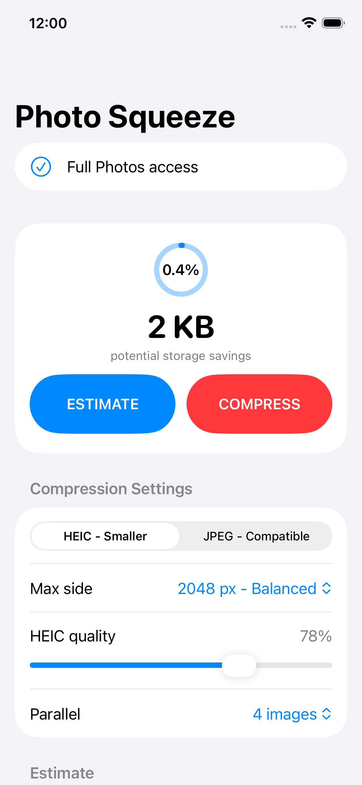

# Photo Squeeze

A simple SwiftUI iOS app that scans the user's Photos library, estimates how much storage could be saved by resizing images to a configurable maximum side length, and can create compressed replacements.

The app lets you choose HEIC or JPEG output, a standard maximum image side length, and compression quality. It defaults to a balanced 2048 px max side. As it scans, a savings meter shows how much storage could be recovered so far. You can also skip the estimate and compress directly in one pass; the app only keeps replacement files that are smaller than the originals.

## Replacement workflow

Photo Squeeze uses a bounded replacement workflow:

1. Read the original image data.
2. Resize and re-encode it directly to a temporary HEIC or JPEG file while copying image metadata.
3. Prepare a bounded batch of replacement files in the app's temporary directory.
4. Ask Photos to create the new assets with the original creation dates and locations.
5. Add the replacements back to user albums that can be modified.
6. Delete the original assets in the same Photos change.
7. Remove that batch's temporary files, then continue with the next batch.

The replacement flow intentionally avoids preparing the whole library at once. It sizes each batch from available temporary storage, keeps a free-space reserve, and caps batches at 1000 photos or 4 GB of temporary replacement files. On devices with enough room, this greatly reduces how often Photos asks for delete confirmation. After a successful replacement run, estimates are cleared instead of automatically recomputed so the app does not immediately recompress the library just to refresh the numbers.

This keeps normal Photos timeline sorting correct because the replacement receives the original `creationDate`. Smart albums, some system-only state, Live Photo motion data, RAW originals, and animated GIF behavior are not rewritten by this workflow, so the app skips Live Photos, RAW images, and GIFs.

## Open in Xcode

Open `PictureCompress.xcodeproj`, select your development team in Signing & Capabilities, then run on a real iPhone. The simulator has no useful Photos library for this workflow.
